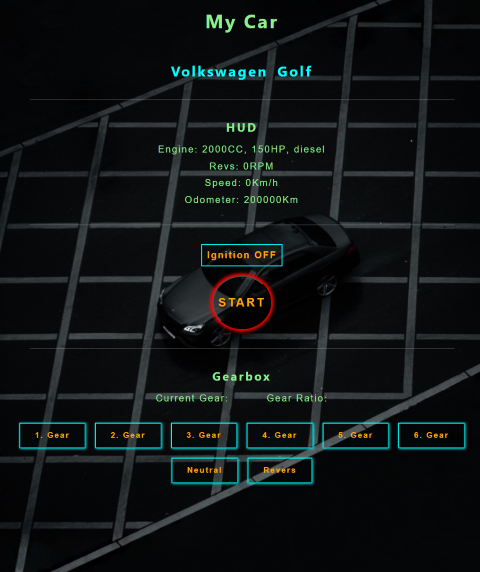

# Programming Foundations CA

**Link** **to** **page:**

### https://norofffeu.github.io/programming-foundations-ca-Torehirth/

## Car object

### This object has the following properties and values:

**Type:** This has nested object properties:

- Brand: Car manufacturer (string value).
- Model: Car model (string value).

**Engine:** This has nested object properties:

- fuel: Type of fuel engine is running on (string value).
- CC: Size of motor volume in cubic centimeters (number value).
- HP: Power of engine in horse power (number).

**Odometer:** Total kilometers car has traveled (number value).

**Gearbox:** Type of gearbox (string value).

**Gears:** Arrays of objects regarding the gears:

- Name: Name of gear (string value).
- Ratio: Gear ratio (number value).

**Revs:** Engine revolutions per minute, initial value of zero (number value).

**Speed:** Speed of car (number value).

**On:** Ignition of car, initial value of false (bolean value).

**Function:** This method/function determines if the cars engine is running or not, based in the "on" property.

I've also added functions for a start button toggle that changes some text/value on some elements on the page by clicking it, and buttons for shifting gears that changes the gear value and gear ratio value on the page.
